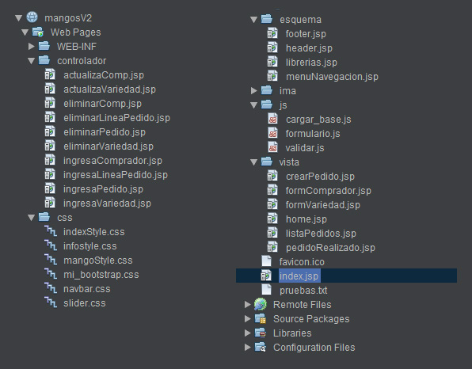
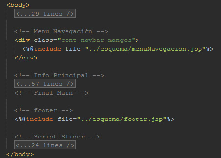
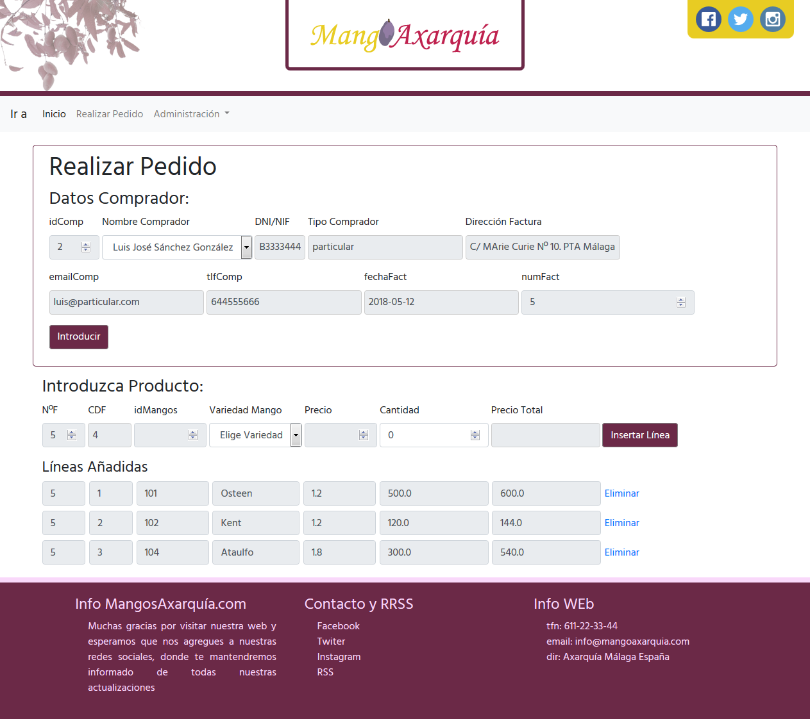
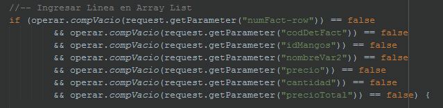
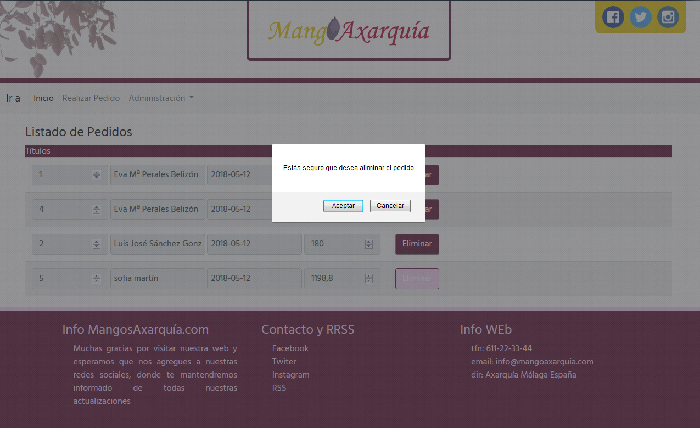

# Aplicación MangoAxarquía V2.0

Alumno: Alejandro Ruiz
Centro: IES Campanillas
Curso: 1ºDAW 2017-2018

Ejercicios de las asignaturas **Programación en Java y Base de Datos MySQL**

## Instalación:
* La base de datos se ha realizado en MySQL por lo que se ha usado un servidor de MySQL versión 5.7 para ser ejecutada. Además se ha utilizado Netbeans por lo que hemos usado el driver JDBC para MySQL con el módulo de conexión mysql-connector-java-5.1.23-bin de Netbeans y la base de datos se ha ido tratadno tanto en NetBeans, como con MYSQL Workbench 6.3.
* Las páginas web están creadas en JSP por lo que necesita un servidor de aplicaciones como GlassFish para ser ejecutadas, se ha usado la versión 4.1.1
* Además se han usado el Framework de CSS bootstrap 4.0 y Javascript por lo que se recomienda usar con conexión a internet.

## Version 2.0: Cambios Realizados
<table>
	<tr>
		<td width="300">
			Estructuración del contenido de los ficheros dentro del proyecto de acuerdo con el punto de vista de patrón de diseño de arquitectura de software Modelo-Vista-Contralador.
		</td>
		<td width="450"></td>
	</tr>
	<tr>
		<td width="300">
			Para hacer menos pesado el código se han externalizado los elementos comunes de las webs: header, navbar, footer... Y se han introducido en los jsp mediante: 
			~~~
			<%@include file="../esquema/header.jsp"%>
			~~~
		</td>
		<td width="450"></td>
	</tr>
	<tr>
		<td width="300">
			Cambios en la estructura de la base de datos. Ver archivo bd/cambios_BD_mangos_CRUD_II.sql 
			Hay también una copia de la base de datos: Backup_mangos
		</td>
		<td width="450"></td>
	</tr>
	<tr>
		<td width="300">
			Creación de la clase Linea para manejar las líneas del pedido. 
			La clase esta en la ruta: Source Packages/mangoObjetos/linea.javabr>
			Ver archivos: crearPedido.jsp - ingresaLineaPedido.jsp - ingresaPedido.jsp
		</td>
		<td width="450"></td>
	</tr>
	<tr>
		<td width="300">
			Uso de ArrayList para contener los objetos linea del pedido e ir actualizandolos. 
			Ver archivos: crearPedido.jsp - ingresaLineaPedido.jsp - ingresaPedido.jsp 
			~~~
			ArrayList<Linea> conjLineas = new ArrayList();
	  	conjLineas = (ArrayList<Linea>) request.getSession().getAttribute("conjLineas");
			~~~
		</td>
		<td width="450"></td>
	</tr>
	<tr>
		<td width="300">
			Creación de la operar.compVacio() Para comprobar si un String viene vacio. 
			La función esta en la ruta: Source Packages/mangoFunciones/operar.java 
			Ver archivos: crearPedido.jsp - ingresaLineaPedido.jsp - ingresaPedido.jsp
		</td>
		<td width="300"></td>
	</tr>
	<tr>
		<td width="300">
			Uso de la variable Session en request.session() para pasar elementos de un jsp a otro.
		</td>
		<td width="450"></td>
	</tr>
	<tr>
		<td width="300">
			Eliminar elementos de la variable Session cuando se haya terminado de realizar un pedido o al salir a otra zona de la web.
		</td>
	</tr>
	<tr>
		<td width="300">
			Mantener el usuario mientras va añadiendo líneas javascript+java. 
			Ver archivos: crearPedido.jsp - ingresaLineaPedido.jsp - ingresaPedido.jsp - formulario.js
		</td>
		<td width="450"></td>
	</tr>
	<tr>
		<td width="300">
			Ingreso de Factura con varias Líneas de pedido.
		</td>
		<td width="450"></td>
	</tr>
	<tr>
		<td width="300">
			Añadida Vista de Consulta de pedidos.
		</td>
		<td width="450"></td>
	</tr>
	<tr>
		<td width="300">
			Validaciones de campos desde el navegador con javascript. Observar campos de Clientes: no se admite un DNI o Teléfono de una longitud distinta de 9. (" Para una futura versión esto se debería de controlar con patrones").
		</td>
		<td width="450"></td>
	</tr>
	<tr>
		<td width="300">
			Control de valores de inserción en la BD del controlador.
			<table>
				<tr>No se puede introducir un pedido sin comprador.</tr>
				<tr>No se puede introducir un pedido sin líneas de factura.</tr>
				<tr>No se puede introducir un pedido sin cantidad.</tr>
			</table>
		</td>
		<td width="450"></td>
	</tr>
	<tr>
		<td width="300">
			Ventanas de alerta a la hora de borrar una variedad, un cliente o un pedido.
		</td>
		<td width="450"></td>
	</tr>
	<tr>
		<td width="300">
			Creación de alertas para mostrar al usuario porque no se ha podido realizar una tarea.
		</td>
		<td width="450"></td>
	</tr>
</table>

## Cambios Propuestas para Version 3.0:
* Modificar Pedidos
* Mejorar validaciones en Vistas, Controlador y Modelo.
* Creación de objetos o funciones para tareas repetitivas: conexiones, validaciones...
* Mejoreas estéticas en la maquetación y el diseño
* Adaptación a web Responsiva
